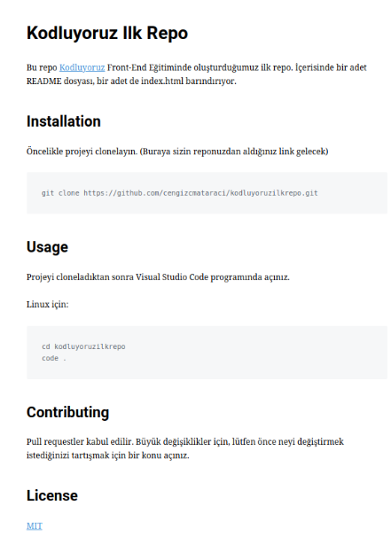

# kodluyoruzilkrepo
Kodluyoruz Eğitimi kapsamında açtığım ilk repo

# Kodluyoruz Ilk Repo

Bu repo [Kodluyoruz](https://academy.patika.dev/courses/git) Front-End Eğitiminde oluşturduğumuz ilk repo. İçerisinde bir adet README dosyası,bir adet de index.html barındırıyor.
 

## Installation

Öncelikle projeyi clonelayin. (Buraya sizin reponuzdan aldiginuz link gelecek)
> git clone https://github.com/enesturhn/kodluyoruzilkrepo.git

## Usage 

Projeyi klonladıktan sonra Visual Studio Code programında açınız.

Linux için;

>cd kodluyoruzilkrepo
>code .

## Contrubuting

Pull requestler kabul edilir. Büyük değişiklikler için, lütfen önce neyi değiştirmek
istediğinizi tartışmak için bir konu açınız.

## License

[MIT](https://choosealicense.com/licenses/mit/)

